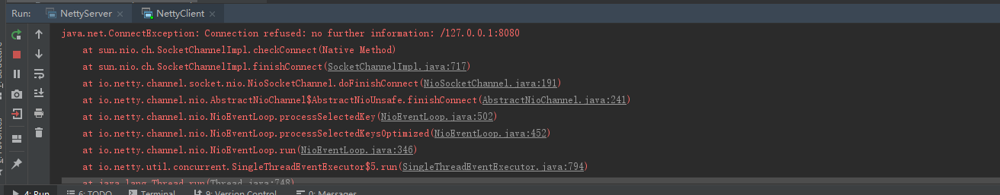

通信协议从广义上区分，可以分为公有协议和私有协议。由于私有协议的灵活性，它往往会在某个公司或者组织内部使用，按需定制，也因为如此，升级起来会非常方便，灵活性好。绝大多数的私有协议传输层都基于TCP/IP，所以利用Netty的NIO TCP协议栈可以非常方便地进行私有协议的定制和开发。

## 私有协议介绍

私有协议本质上是厂商内部发展和采用的标准，除非授权，其他厂商一般无权使用该协议。私有协议也称非标准协议，就是未经国际或国家标准化组织采纳或批准，由某个企业自己制订，协议实现细节不愿公开，只在企业自己生产的设备之间使用的协议。私有协议具有封闭性、垄断性、排他性等特点。如果网上大量存在私有（非标准）协议，现行网络或用户一旦使用了它，后进入的厂家设备就必须跟着使用这种非标准协议，才能够互连互通，否则根本不可能进入现行网络。这样，使用非标准协议的厂家就实现了垄断市场的愿望。

在传统的Java应用中，通常使用以下4种方式进行跨节点通信。

（1）通过RMI进行远程服务调用；

（2）通过Java的Socket+Java序列化的方式进行跨节点调用；

（3）利用一些开源的RPC框架进行远程服务调用，例如Facebook的Thrift，Apache的Avro等；

（4）利用标准的公有协议进行跨节点服务调用，例如HTTP+XML、RESTful+JSON或者WebService。

跨节点的远程服务调用，除了链路层的物理连接外，还需要对请求和响应消息进行编解码。在请求和应答消息本身以外，也需要携带一些其他控制和管理类指令，例如链路建立的握手请求和响应消息、链路检测的心跳消息等。当这些功能组合到一起之后，就会形成私有协议。

事实上，私有协议并没有标准的定义，只要是能够用于跨进程、跨主机数据交换的非标准协议，都可以称为私有协议。通常情况下，正规的私有协议都有具体的协议规范文档，类似于《XXXX协议VXX规范》，但是在实际的项目中，内部使用的私有协议往往是口头约定的规范，由于并不需要对外呈现或者被外部调用，所以一般不会单独写相关的内部私有协议规范文档。

#### 协议栈功能描述：

1. 基于Netty的NIO通信框架，提供高性能的异步通信能力；
2. 提供消息的编解码框架，实现POJO的序列化和反序列化
3. 提供基于IP地址的白名单接入认证机制；
4. 链路的有效性校验机制；
5. 链路的断线重连机制；

**通信模型** 


（1）Netty协议栈客户端发送握手请求消息，携带节点ID等有效身份认证信息；

（2）Netty协议栈服务端对握手请求消息进行合法性校验，包括节点ID有效性校验、节点重复登录校验和IP地址合法性校验，校验通过后，返回登录成功的握手应答消息；

（3）链路建立成功之后，客户端发送业务消息；

（4）链路成功之后，服务端发送心跳消息；

（5）链路建立成功之后，客户端发送心跳消息；

（6）链路建立成功之后，服务端发送业务消息；

（7）服务端退出时，服务端关闭连接，客户端感知对方关闭连接后，被动关闭客户端连接。

备注：需要指出的是，Netty协议通信双方链路建立成功之后，双方可以进行全双工通信，无论客户端还是服务端，都可以主动发送请求消息给对方，通信方式可以是TWO WAY或者ONE WAY。双方之间的心跳采用Ping-Pong机制，当链路处于空闲状态时，客户端主动发送Ping消息给服务端，服务端接收到Ping消息后发送应答消息Pong给客户端，如果客户端连续发送N条Ping消息都没有接收到服务端返回的Pong消息，说明链路已经挂死或者对方处于异常状态，客户端主动关闭连接，间隔周期T后发起重连操作，直到重连成功。

### 消息定义

Netty协议栈消息定义包含两部分：

1. 消息头；
2. 消息体。


### Netty协议支持的字段类型


### Netty协议的编解码规范

1.Netty协议的编码

Netty协议NettyMessage的编码规范如下:

（1）crcCode：java.nio.ByteBuffer.putInt(int value)，如果采用其他缓冲区实现，必须与其等价；

（2）length：java.nio.ByteBuffer.putInt(int value)，如果采用其他缓冲区实现，必须与其等价；

（3）sessionID：java.nio.ByteBuffer.putLong(long value)，如果采用其他缓冲区实现，必须与其等价；

（4）type: java.nio.ByteBuffer.put(byte b)，如果采用其他缓冲区实现，必须与其等价；

（5）priority：java.nio.ByteBuffer.put(byte b)，如果采用其他缓冲区实现，必须与其等价；

（6）attachment：它的编码规则为——如果attachment长度为0，表示没有可选附件，则将长度编码设为0，java.nio.ByteBuffer.putInt(0)；如果大于0，说明有附件需要编码，具体的编码规则如下:首先对附件的个数进行编码，java.nio.ByteBuffer.putInt(attachment.size())；然后对Key进行编码，再将它转换成byte数组之后编码内容.

（7）body的编码：通过JBoss Marshalling将其序列化为byte数组，然后调用java.nio.ByteBuffer.put(byte [] src)将其写入ByteBuffer缓冲区中。

由于整个消息的长度必须等全部字段都编码完成之后才能确认，所以最后需要更新消息头中的length字段，将其重新写入ByteBuffer中。

2.Netty协议的解码

相对于NettyMessage的编码，仍旧以java.nio.ByteBuffer为例，给出Netty协议的解码规范。

（1）crcCode：通过java.nio.ByteBuffer.getInt()获取校验码字段，其他缓冲区需要与其等价；

（2）length：通过java.nio.ByteBuffer.getInt()获取Netty消息的长度，其他缓冲区需要与其等价；

（3）sessionID：通过java.nio.ByteBuffer.getLong()获取会话ID，其他缓冲区需要与其等价；

（4）type：通过java.nio.ByteBuffer.get()获取消息类型，其他缓冲区需要与其等价；

（5）priority：通过java.nio.ByteBuffer.get()获取消息优先级，其他缓冲区需要与其等价；

 （6）attachment：它的解码规则为——首先创建一个新的attachment对象，调用java.nio.ByteBuffer.getInt()获取附件的长度，如果为0，说明附件为空，解码结束，继续解消息体；如果非空，则根据长度通过for循环进行解码。

 （7）body：通过JBoss的marshaller对其进行解码。

### 链路的建立

Netty协议栈支持服务端和客户端，对于使用Netty协议栈的应用程序而言，不需要刻意区分到底是客户端还是服务端，在分布式组网环境中，一个节点可能既是服务端也是客户端，这个依据具体的用户场景而定。

Netty协议栈对客户端的说明如下：如果A节点需要调用B节点的服务，但是A和B之间还没有建立物理链路，则由调用方主动发起连接，此时，调用方为客户端，被调用方为服务端。

考虑到安全，链路建立需要通过基于IP地址或者号段的黑白名单安全认证机制，作为样例，本协议使用基于IP地址的安全认证，如果有多个IP，通过逗号进行分割。在实际商用项目中，安全认证机制会更加严格，例如通过密钥对用户名和密码进行安全认证。

客户端与服务端链路建立成功之后，由客户端发送握手请求消息，握手请求消息的定义如下。

（1）消息头的type字段值为3；

（2）可选附件为个数为0；

（3）消息体为空；

（4）握手消息的长度为22个字节。

服务端接收到客户端的握手请求消息之后，如果IP校验通过，返回握手成功应答消息给客户端，应用层链路建立成功。握手应答消息定义如下。

（1）消息头的type字段值为4；

（2）可选附件个数为0；

（3）消息体为byte类型的结果，0：认证成功；-1：认证失败。

链路建立成功之后，客户端和服务端就可以互相发送业务消息了。

### 链路的关闭

由于采用长连接通信，在正常的业务运行期间，双方通过心跳和业务消息维持链路，任何一方都不需要主动关闭连接。

但是，在以下情况下，客户端和服务端需要关闭连接。

（1）当对方宕机或者重启时，会主动关闭链路，另一方读取到操作系统的通知信号，得知对方REST链路，需要关闭连接，释放自身的句柄等资源。由于采用TCP全双工通信，通信双方都需要关闭连接，释放资源；

（2）消息读写过程中，发生了I/O异常，需要主动关闭连接；

（3）心跳消息读写过程中发生了I/O异常，需要主动关闭连接；

（4）心跳超时，需要主动关闭连接；

（5）发生编码异常等不可恢复错误时，需要主动关闭连接。

### 可靠性设计

Netty协议栈可能会运行在非常恶劣的网络环境中，网络超时、闪断、对方进程僵死或者处理缓慢等情况都有可能发生。为了保证在这些极端异常场景下Netty协议栈仍能够正常工作或者自动恢复，需要对它的可靠性进行统一规划和设计。

1.心跳机制

在凌晨等业务低谷期时段，如果发生网络闪断、连接被Hang住等网络问题时，由于没有业务消息，应用进程很难发现。到了白天业务高峰期时，会发生大量的网络通信失败，严重的会导致一段时间进程内无法处理业务消息。为了解决这个问题，在网络空闲时采用心跳机制来检测链路的互通性，一旦发现网络故障，立即关闭链路，主动重连。

具体的设计思路如下。

（1）当网络处于空闲状态持续时间达到T（连续周期T没有读写消息）时，客户端主动发送Ping心跳消息给服务端；

（2）如果在下一个周期T到来时客户端没有收到对方发送的Pong心跳应答消息或者读取到服务端发送的其他业务消息，则心跳失败计数器加1；

（3）每当客户端接收到服务的业务消息或者Pong应答消息，将心跳失败计数器清零；当连续N次没有接收到服务端的Pong消息或者业务消息，则关闭链路，间隔INTERVAL时间后发起重连操作；

（4）服务端网络空闲状态持续时间达到T后，服务端将心跳失败计数器加1；只要接收到客户端发送的Ping消息或者其他业务消息，计数器清零；

（5）服务端连续N次没有接收到客户端的Ping消息或者其他业务消息，则关闭链路，释放资源，等待客户端重连。

通过Ping-Pong双向心跳机制，可以保证无论通信哪一方出现网络故障，都能被及时地检测出来。为了防止由于对方短时间内繁忙没有及时返回应答造成的误判，只有连续N次心跳检测都失败才认定链路已经损害，需要关闭链路并重建链路。

当读或者写心跳消息发生I/O异常的时候，说明链路已经中断，此时需要立即关闭链路，如果是客户端，需要重新发起连接。如果是服务端，需要清空缓存的半包信息，等待客户端重连。

2.重连机制

如果链路中断，等待INTERVAL时间后，由客户端发起重连操作，如果重连失败，间隔周期INTERVAL后再次发起重连，直到重连成功。

为了保证服务端能够有充足的时间释放句柄资源，在首次断连时客户端需要等待INTERVAL时间之后再发起重连，而不是失败后就立即重连。

为了保证句柄资源能够及时释放，无论什么场景下的重连失败，客户端都必须保证自身的资源被及时释放，包括但不限于SocketChannel、Socket等。

重连失败后，需要打印异常堆栈信息，方便后续的问题定位。

3.重复登录保护

当客户端握手成功之后，在链路处于正常状态下，不允许客户端重复登录，以防止客户端在异常状态下反复重连导致句柄资源被耗尽。

服务端接收到客户端的握手请求消息之后，首先对IP地址进行合法性检验，如果校验成功，在缓存的地址表中查看客户端是否已经登录，如果已经登录，则拒绝重复登录，返回错误码-1，同时关闭TCP链路，并在服务端的日志中打印握手失败的原因。

客户端接收到握手失败的应答消息之后，关闭客户端的TCP连接，等待INTERVAL时间之后，再次发起TCP连接，直到认证成功。

为了防止由服务端和客户端对链路状态理解不一致导致的客户端无法握手成功的问题，当服务端连续N次心跳超时之后需要主动关闭链路，清空该客户端的地址缓存信息，以保证后续该客户端可以重连成功，防止被重复登录保护机制拒绝掉。

4.消息缓存重发

无论客户端还是服务端，当发生链路中断之后，在链路恢复之前，缓存在消息队列中待发送的消息不能丢失，等链路恢复之后，重新发送这些消息，保证链路中断期间消息不丢失。

考虑到内存溢出的风险，建议消息缓存队列设置上限，当达到上限之后，应该拒绝继续向该队列添加新的消息。

### 安全性设计

为了保证整个集群环境的安全，内部长连接采用基于IP地址的安全认证机制，服务端对握手请求消息的IP地址进行合法性校验：如果在白名单之内，则校验通过；否则，拒绝对方连接。

如果将Netty协议栈放到公网中使用，需要采用更加严格的安全认证机制，例如基于密钥和AES加密的用户名+密码认证机制，也可以采用SSL/TSL安全传输。

作为示例程序，Netty协议栈采用最简单的基于IP地址的白名单安全认证机制。

### 可扩展性设计

Netty协议需要具备一定的扩展能力，业务可以在消息头中自定义业务域字段，例如消息流水号、业务自定义消息头等。通过Netty消息头中的可选附件attachment字段，业务可以方便地进行自定义扩展。

Netty协议栈架构需要具备一定的扩展能力，例如统一的消息拦截、接口日志、安全、加解密等可以被方便地添加和删除，不需要修改之前的逻辑代码，类似Servlet的FilterChain和AOP，但考虑到性能因素，不推荐通过AOP来实现功能的扩展。

## Netty协议栈开发

pom.xml 引用jar  其中一部分为项目中其他功能在使用，主要使用 jboss-marshalling-serial  jboss-marshalling netty-all 这三个。

```xml
<?xml version="1.0" encoding="UTF-8"?>
<project xmlns="http://maven.apache.org/POM/4.0.0" xmlns:xsi="http://www.w3.org/2001/XMLSchema-instance"
         xsi:schemaLocation="http://maven.apache.org/POM/4.0.0 http://maven.apache.org/xsd/maven-4.0.0.xsd">
    <modelVersion>4.0.0</modelVersion>

    <groupId>com.zhaowb</groupId>
    <artifactId>netty</artifactId>
    <version>0.0.1-SNAPSHOT</version>
    <packaging>jar</packaging>

    <name>netty</name>
    <description>Demo project for Spring Boot</description>

    <properties>
        <project.build.sourceEncoding>UTF-8</project.build.sourceEncoding>
        <project.reporting.outputEncoding>UTF-8</project.reporting.outputEncoding>
        <java.version>1.8</java.version>
    </properties>

    <dependencies>

        <!-- https://mvnrepository.com/artifact/org.jboss.marshalling/jboss-marshalling-serial -->
        <dependency>
            <groupId>org.jboss.marshalling</groupId>
            <artifactId>jboss-marshalling-serial</artifactId>
            <version>2.0.5.Final</version>
          <!--  <scope>test</scope>--><!-- 一定一定不要有test ，如果有test 会导致Marshalling.getProvidedMarshallerFactory("serial"); 为null-->
        </dependency>
        <!-- https://mvnrepository.com/artifact/org.jboss.marshalling/jboss-marshalling -->
        <dependency>
            <groupId>org.jboss.marshalling</groupId>
            <artifactId>jboss-marshalling</artifactId>
            <version>2.0.5.Final</version>
        </dependency>

        <!-- https://mvnrepository.com/artifact/io.netty/netty-all -->
        <dependency>
            <groupId>io.netty</groupId>
            <artifactId>netty-all</artifactId>
            <version>5.0.0.Alpha1</version>
        </dependency>

        <dependency>
            <groupId>io.netty</groupId>
            <artifactId>netty-common</artifactId>
            <version>5.0.0.Alpha1</version>
        </dependency>

        <!-- https://mvnrepository.com/artifact/org.samba.jcifs/jcifs -->
        <dependency>
            <groupId>org.samba.jcifs</groupId>
            <artifactId>jcifs</artifactId>
            <version>1.3.14-kohsuke-1</version>
        </dependency>
        <!-- https://mvnrepository.com/artifact/commons-net/commons-net -->
        <dependency>
            <groupId>commons-net</groupId>
            <artifactId>commons-net</artifactId>
            <version>3.6</version>
        </dependency>

        <dependency>
            <groupId>commons-codec</groupId>
            <artifactId>commons-codec</artifactId>
            <version>1.10</version>
        </dependency>

        <dependency>
            <groupId>com.alibaba</groupId>
            <artifactId>fastjson</artifactId>
            <version>1.2.9</version>
        </dependency>

        <!-- https://mvnrepository.com/artifact/commons-io/commons-io -->
        <dependency>
            <groupId>commons-io</groupId>
            <artifactId>commons-io</artifactId>
            <version>2.6</version>
        </dependency>

        <dependency>
            <groupId>org.slf4j</groupId>
            <artifactId>slf4j-log4j12</artifactId>
            <version>1.7.6</version>
        </dependency>
        <!-- slf4j bound to Log4j end -->

    </dependencies>

    <build>
        <plugins>
            <plugin>
                <groupId>org.springframework.boot</groupId>
                <artifactId>spring-boot-maven-plugin</artifactId>
            </plugin>
        </plugins>
    </build>
</project>

```

### 数据结构定义 

```java
package com.zhaowb.netty.ch14;

/**
 * NettyMessage 类定义
 */
public class NettyMessage {

    private Header header;//消息头
    private Object body;// 消息体

    public final Header getHeader() {
        return header;
    }

    public final void setHeader(Header header) {
        this.header = header;
    }

    public final Object getBody() {
        return body;
    }

    public final void setBody(Object body) {
        this.body = body;
    }

    @Override
    public String toString() {
        return "NettyMessage{" +
                "header=" + header +
                ", body=" + body +
                '}';
    }
}
```

```java
package com.zhaowb.netty.ch14;

import java.util.Map;
import java.util.HashMap;

/**
 * 消息头 Header 类定义
 */
public class Header {

    private int crcCode = 0xabef0101;
    private int length;// 消息长度
    private long sessionID; // 会话 ID
    private byte type; // 消息类型
    private byte priority;// 消息优先级
    private Map<String, Object> attachment = new HashMap<String, Object>();

    public final int getCrcCode() {
        return crcCode;
    }

    public final void setCrcCode(int crcCode) {
        this.crcCode = crcCode;
    }

    public final int getLength() {
        return length;
    }

    public final void setLength(int length) {
        this.length = length;
    }

    public final long getSessionID() {
        return sessionID;
    }

    public final void setSessionID(long sessionID) {
        this.sessionID = sessionID;
    }

    public final byte getType() {
        return type;
    }

    public final void setType(byte type) {
        this.type = type;
    }

    public final byte getPriority() {
        return priority;
    }

    public final void setPriority(byte priority) {
        this.priority = priority;
    }

    public final Map<String, Object> getAttachment() {
        return attachment;
    }

    public final void setAttachment(Map<String, Object> attachment) {
        this.attachment = attachment;
    }

    @Override
    public String toString() {
        return "Header{" +
                "crcCode=" + crcCode +
                ", length=" + length +
                ", sessionID=" + sessionID +
                ", type=" + type +
                ", priority=" + priority +
                ", attachment=" + attachment +
                '}';
    }
}
```

#### JBossMarshallingFactory

```java
package com.zhaowb.netty.ch14;

import org.jboss.marshalling.*;
import java.io.IOException;

public class MarshallingCodecFactory {

    /**
     * 创建Jboss Marshaller
     *
     * @return
     * @throws IOException
     */
    protected static Marshaller buildMarshalling() throws IOException {
        final MarshallerFactory marshallerFactory = Marshalling.getProvidedMarshallerFactory("serial");
        final MarshallingConfiguration configuration = new MarshallingConfiguration();
        configuration.setVersion(5);
        Marshaller marshaller = marshallerFactory.createMarshaller(configuration);
        return marshaller;
    }

    /**
     * 创建jboss Unmarshaller
     *
     * @return
     * @throws IOException
     */
    protected static Unmarshaller buildUnmarshaller() throws IOException {
        final MarshallerFactory marshallerFactory = Marshalling.getProvidedMarshallerFactory("serial");
        final MarshallingConfiguration configuration = new MarshallingConfiguration();
        configuration.setVersion(5);
        Unmarshaller unmarshaller = marshallerFactory.createUnmarshaller(configuration);
        return unmarshaller;
    }
}
```

增加JBossMarshalling序列化对象->ByteBuf工具

```java
package com.zhaowb.netty.ch14;

import io.netty.buffer.ByteBuf;
import org.jboss.marshalling.Marshaller;

import java.io.IOException;

/**
 * netty 消息编码工具类MarshallingEncoder
 */
public class MarshallingEncoder {

    private static final byte[] LENGTH_PLACEHOLDER = new byte[4];
    Marshaller marshaller;

    public MarshallingEncoder() throws IOException {
        marshaller = MarshallingCodecFactory.buildMarshalling();
    }

    // 使用marshall对Object进行编码，并且写入bytebuf...
    protected void encode(Object msg, ByteBuf out) throws Exception {

        try {
            //1. 获取写入位置
            int lengthPos = out.writerIndex();
            //2. 先写入4个bytes，用于记录Object对象编码后长度
            out.writeBytes(LENGTH_PLACEHOLDER);
            //3. 使用代理对象，防止marshaller写完之后关闭byte buf
            ChannelBufferByteOutput output = new ChannelBufferByteOutput(out);
            //4. 开始使用marshaller往bytebuf中编码
            marshaller.start(output);
            marshaller.writeObject(msg);
            //5. 结束编码
            marshaller.finish();
            //6. 设置对象长度
            out.setInt(lengthPos, out.writerIndex() - lengthPos - 4);
        } finally {
            marshaller.close();
        }
    }
}
```

```java
package com.zhaowb.netty.ch14;

import io.netty.buffer.ByteBuf;
import org.jboss.marshalling.ByteOutput;

import java.io.IOException;

public class ChannelBufferByteOutput implements ByteOutput {

    private final ByteBuf buffer;

    public ChannelBufferByteOutput(ByteBuf buffer) {
        this.buffer = buffer;
    }

    @Override
    public void write(int i) throws IOException {
        buffer.writeByte(i);
    }

    @Override
    public void write(byte[] bytes) throws IOException {
        buffer.writeBytes(bytes);
    }

    @Override
    public void write(byte[] bytes, int i, int i1) throws IOException {
        buffer.writeBytes(bytes, i, i1);
    }

    @Override
    public void close() throws IOException {

    }

    @Override
    public void flush() throws IOException {

    }

    ByteBuf getBuffer() {
        return buffer;
    }
}
```

增加JBossMarshalling反序列化对象<-ByteBuf工具

```java
package com.zhaowb.netty.ch14;

import io.netty.buffer.ByteBuf;
import org.jboss.marshalling.ByteInput;
import org.jboss.marshalling.*;

import java.io.IOException;

/**
 * netty 消息解码工具类 MarshallingDecoder
 */
public class MarshallingDecoder {

    private final Unmarshaller unmarshaller;

    public MarshallingDecoder() throws IOException {
        unmarshaller = MarshallingCodecFactory.buildUnmarshaller();
    }

    protected Object decode(ByteBuf in) throws Exception {
        //1. 读取第一个4bytes，里面放置的是object对象的byte长度
        int objectSize = in.readInt();
        ByteBuf buf = in.slice(in.readerIndex(), objectSize);
        //2 . 使用bytebuf的代理类
        ByteInput input = new ChannelBufferByteInput(buf);
        try {
            //3. 开始解码
            unmarshaller.start(input);
            Object obj = unmarshaller.readObject();
            unmarshaller.finish();
            //4. 读完之后设置读取的位置
            in.readerIndex(in.readerIndex() + objectSize);
            return obj;
        } finally {
            unmarshaller.close();
        }
    }
}
```

```java
package com.zhaowb.netty.ch14;

import io.netty.buffer.ByteBuf;
import org.jboss.marshalling.ByteInput;

import java.io.IOException;

public class ChannelBufferByteInput implements ByteInput {
    private final ByteBuf buffer;

    public ChannelBufferByteInput(ByteBuf buffer) {
        this.buffer = buffer;
    }

    @Override
    public int read() throws IOException {
        if (buffer.isReadable()) {
            return buffer.readByte() & 0xff;
        }
        return -1;
    }

    @Override
    public int read(byte[] bytes) throws IOException {
        return read(bytes, 0, bytes.length);
    }

    @Override
    public int read(byte[] bytes, int i, int i1) throws IOException {
        int available = available();
        if (available == 0) {
            return -1;
        }

        i1 = Math.min(available, i1);
        buffer.readBytes(bytes, i, i1);
        return i1;
    }

    @Override
    public int available() throws IOException {
        return buffer.readableBytes();
    }

    @Override
    public long skip(long l) throws IOException {
        int readable = buffer.readableBytes();
        if (readable < l) {
            l = readable;
        }
        buffer.readerIndex((int) (buffer.readerIndex() + l));
        return l;
    }

    @Override
    public void close() throws IOException {

    }
}
```

根据上述所说的进行对消息编解码:

```java
package com.zhaowb.netty.ch14;

import io.netty.buffer.ByteBuf;
import io.netty.channel.ChannelHandlerContext;
import io.netty.handler.codec.MessageToByteEncoder;

import java.io.IOException;
import java.util.Map;

/**
 * netty 消息编码类 NettyMessageEncoder
 */
public class NettyMessageEncoder extends MessageToByteEncoder<NettyMessage> {

    MarshallingEncoder marshallingEncoder;

    public NettyMessageEncoder() throws IOException {
        this.marshallingEncoder = new MarshallingEncoder();
    }

    @Override
    protected void encode(ChannelHandlerContext ctx, NettyMessage msg, ByteBuf sendBuf) throws Exception {
        if (null == msg || null == msg.getHeader()) {
            throw new Exception("The encode message is null");
        }
        //---写入crcCode---
        sendBuf.writeInt((msg.getHeader().getCrcCode()));
        //---写入length---
        sendBuf.writeInt((msg.getHeader().getLength()));
        //---写入sessionId---
        sendBuf.writeLong((msg.getHeader().getSessionID()));
        //---写入type---
        sendBuf.writeByte((msg.getHeader().getType()));
        //---写入priority---
        sendBuf.writeByte((msg.getHeader().getPriority()));
        //---写入附件大小---
        sendBuf.writeInt((msg.getHeader().getAttachment().size()));
        String key = null;
        byte[] keyArray = null;
        Object value = null;
        for (Map.Entry<String, Object> param : msg.getHeader().getAttachment()
                .entrySet()) {
            key = param.getKey();
            keyArray = key.getBytes("UTF-8");
            sendBuf.writeInt(keyArray.length);
            sendBuf.writeBytes(keyArray);
            value = param.getValue();
            // marshallingEncoder.encode(value, sendBuf);
        }
        // for gc
        key = null;
        keyArray = null;
        value = null;

        if (msg.getBody() != null) {
            marshallingEncoder.encode(msg.getBody(), sendBuf);
        } else
            sendBuf.writeInt(0);
        // 之前写了crcCode 4bytes，除去crcCode和length 8bytes即为更新之后的字节
        sendBuf.setInt(4, sendBuf.readableBytes() - 8);
    }
}
```

```java
package com.zhaowb.netty.ch14;

import io.netty.buffer.ByteBuf;
import io.netty.channel.ChannelHandlerContext;
import io.netty.handler.codec.LengthFieldBasedFrameDecoder;

import java.io.IOException;
import java.util.HashMap;
import java.util.Map;

/**
 * netty 消息解码类 NettyMessageDecoder
 */
public class NettyMessageDecoder extends LengthFieldBasedFrameDecoder {

    MarshallingDecoder marshallingDecoder;

    public NettyMessageDecoder(int maxFrameLength, int lengthFieldOffset, int lengthFieldLength) throws IOException {
        super(maxFrameLength, lengthFieldOffset, lengthFieldLength);
        marshallingDecoder = new MarshallingDecoder();
    }

    @Override
    protected Object decode(ChannelHandlerContext ctx, ByteBuf in) throws Exception {
        ByteBuf frame = (ByteBuf) super.decode(ctx, in);
        if (frame == null) {
            return null;
        }
        NettyMessage message = new NettyMessage();
        Header header = new Header();
        header.setCrcCode(frame.readInt());
        header.setLength(frame.readInt());
        header.setSessionID(frame.readLong());
        header.setType(frame.readByte());
        header.setPriority(frame.readByte());

        int size = frame.readInt();
        if (size > 0) {
            Map<String, Object> attch = new HashMap<String, Object>(size);
            int keySize = 0;
            byte[] keyArray = null;
            String key = null;
            for (int i = 0; i < size; i++) {
                keySize = frame.readInt();
                keyArray = new byte[keySize];
                frame.readBytes(keyArray);
                key = new String(keyArray, "UTF-8");
                attch.put(key, marshallingDecoder.decode(frame));
            }
            keyArray = null;
            key = null;
            header.setAttachment(attch);
        }
        if (frame.readableBytes() > 4) {
            message.setBody(marshallingDecoder.decode(frame));
        }
        message.setHeader(header);
        return message;
    }
}
```

关键在于解码器继承了LengthFieldBasedFrameDecoder，三个参数:

```java
ch.pipeline().addLast(new NettyMessageDecoder(1024 * 1024, 4, 4));
```

第一个参数：1024*1024: 最大长度,

第二个参数: 从第4个bytes开始表示是长度,

第三个参数: 有4个bytes的长度表示是长度

##  握手和安全认证

Netty的机制大多是基于Handler链。

client端在通道激活时构建login请求：

```java
package com.zhaowb.netty.ch14;

import io.netty.channel.ChannelHandlerAdapter;
import io.netty.channel.ChannelHandlerContext;
import org.slf4j.Logger;
import org.slf4j.LoggerFactory;

import java.net.InetSocketAddress;
import java.util.HashMap;
import java.util.Map;

/**
 * 服务端的握手接入和安全认证
 */
public class LoginAuthRespHandler extends ChannelHandlerAdapter {

    private static final Logger LOGGER = LoggerFactory.getLogger(NettyClient.class);
    /**
     * 本地缓存
     */
    private Map<String, Boolean> nodeCheck = new HashMap<String, Boolean>();

    private String[] whiteList = {"127.0.0.1", "192.168.1.156"};


    @Override
    public void channelActive(ChannelHandlerContext ctx) throws Exception {
        LOGGER.info("LoginAuthRespHandler  channelActive");
    }

    @Override
    public void exceptionCaught(ChannelHandlerContext ctx, Throwable cause) throws Exception {
        cause.printStackTrace();
        nodeCheck.remove(ctx.channel().remoteAddress().toString());// 删除缓存
        ctx.close();
        ctx.fireExceptionCaught(cause);
    }

    @Override
    public void channelRead(ChannelHandlerContext ctx, Object msg) throws Exception {
        NettyMessage message = (NettyMessage) msg;

        LOGGER.info("LoginAuthRespHandler server 接收到的消息 msg : =  " + msg);
        // 如果是握手请求消息，处理，其它消息透传
        if (message.getHeader() != null && message.getHeader().getType() == MessageType.LOGIN_REQ.value()) {
            String nodeIndex = ctx.channel().remoteAddress().toString();
            NettyMessage loginResp = null;
            // 重复登陆，拒绝
            if (nodeCheck.containsKey(nodeIndex)) {
                loginResp = buildResponse((byte) -1);
            } else {
                InetSocketAddress address = (InetSocketAddress) ctx.channel().remoteAddress();
                String ip = address.getAddress().getHostAddress();
                boolean isOK = false;
                for (String WIP : whiteList) {
                    if (WIP.equals(ip)) {
                        isOK = true;
                        break;
                    }
                }
                loginResp = isOK ? buildResponse((byte) 0) : buildResponse((byte) -1);
                if (isOK) {
                    nodeCheck.put(nodeIndex, true);
                }
                LOGGER.info("The login response is :" + loginResp + " body [" + loginResp.getBody() + "]");
                ctx.writeAndFlush(loginResp);
            }
        } else {
            ctx.fireChannelRead(msg);
        }
    }

    private NettyMessage buildResponse(byte result) {

        NettyMessage message = new NettyMessage();
        Header header = new Header();
        header.setType(MessageType.LOGIN_RESP.value());
        message.setHeader(header);
        message.setBody(result);
        return message;
    }
}
```

server端判断是否是login请求，并对ip进行验证:

```java
package com.zhaowb.netty.ch14;

import io.netty.channel.ChannelHandlerAdapter;
import io.netty.channel.ChannelHandlerContext;
import org.slf4j.Logger;
import org.slf4j.LoggerFactory;

/**
 * 握手认证客户端，用于在通道激活时发起握手请求
 */
public class LoginAuthReqHandler extends ChannelHandlerAdapter {

    private static final Logger LOGGER = LoggerFactory.getLogger(NettyClient.class);

    @Override
    public void channelActive(ChannelHandlerContext ctx) throws Exception {
        LOGGER.info("LoginAuthReqHandler channelActive");

        //当客户端跟服务端TCP三次握手成功之后，由客户端构造握手请求消息发送给服务端
        ctx.writeAndFlush(buildLoginReq());

        LOGGER.info("LoginAuthReqHandler 发送登陆请求" + buildLoginReq().toString());
    }

    // 握手请求发送之后，按照协议规范，服务端需要返回握手应答消息。
    @Override
    public void channelRead(ChannelHandlerContext ctx, Object msg) throws Exception {
        NettyMessage message = (NettyMessage) msg;
        // 如果是握手应答消息，需要判断是否认证成功
        //对握手应答消息进行处理，首先判断消息是否是握手应答消息，
        if (message.getHeader() != null && message.getHeader().getType() == MessageType.LOGIN_RESP.value()) {
            byte loginResult = (byte) message.getBody();
            if (loginResult != (byte) 0) {
                // 如果是握手应答消息，则对应答结果进行判断，如果非0，说明认证失败，关闭链路，重新发起连接。
                // 握手失败，关闭链路
                ctx.close();
            } else {
                LOGGER.info("Login is ok : " + message);
                ctx.fireChannelRead(msg);
            }
        } else {
            // 如果不是，直接透传给后面的ChannelHandler进行处理；
            //调用下一个channel链..
            ctx.fireChannelRead(msg);
        }
    }

    /**
     * 构建登录请求
     */
    private NettyMessage buildLoginReq() {
        // 由于采用IP白名单认证机制，因此，不需要携带消息体，消息体为空，消息类型为3：握手请求消息。
        NettyMessage message = new NettyMessage();
        Header header = new Header();
        header.setType(MessageType.LOGIN_REQ.value());
        message.setHeader(header);
        return message;
    }

    @Override
    public void exceptionCaught(ChannelHandlerContext ctx, Throwable cause) throws Exception {

        cause.printStackTrace();
        ctx.fireExceptionCaught(cause);
    }
}
```

## 心跳机制检测

握手成功之后，由客户端主动发送心跳消息，服务端接收到心跳消息之后，返回应答，由于心跳消息的目的是为了检测链路的可用性，因此不需要携带消息体。

```java
package com.zhaowb.netty.ch14;

import io.netty.channel.ChannelHandlerAdapter;
import io.netty.channel.ChannelHandlerContext;
import org.slf4j.Logger;
import org.slf4j.LoggerFactory;

import java.util.concurrent.ScheduledFuture;
import java.util.concurrent.TimeUnit;

/**
 * 客户端发送心跳
 */
public class HeartBeatReqHandler extends ChannelHandlerAdapter {

    private static final Logger LOGGER = LoggerFactory.getLogger(NettyClient.class);

    //使用定时任务发送
    private volatile ScheduledFuture<?> heartBeat;

    @Override
    public void channelRead(ChannelHandlerContext ctx, Object msg) throws Exception {
        NettyMessage message = (NettyMessage) msg;
        // 当握手成功后，Login响应向下透传，主动发送心跳消息
        if (message.getHeader() != null && message.getHeader().getType() == MessageType.LOGIN_RESP.value()) {
            // NioEventLoop是一个Schedule,因此支持定时器的执行，创建心跳计时器，握手成功消息，启动无限循环定时器用于定
            // 时发送心跳，每5秒发送一条心跳消息
            heartBeat = ctx.executor().scheduleAtFixedRate(
                    new HeartBeatReqHandler.HeartBeatTask(ctx), 0, 5000, TimeUnit.MILLISECONDS
            );
        } else if (message.getHeader() != null && message.getHeader().getType() == MessageType.HEARTBEAT_RESP.value()) {
            LOGGER.info("Client receive server heart beat message : ---> " + message);
        } else {
            ctx.fireChannelRead(msg);
        }
    }

    //Ping消息任务类
    private class HeartBeatTask implements Runnable {
        private final ChannelHandlerContext ctx;

        public HeartBeatTask(final ChannelHandlerContext ctx) {
            this.ctx = ctx;
        }

        @Override
        public void run() {
            NettyMessage heatBeat = buildHeartBeat();
            LOGGER.info("Client send heart beat message to server : ---> " + heatBeat);
            ctx.writeAndFlush(heatBeat);
        }
    }

    private NettyMessage buildHeartBeat() {
        NettyMessage message = new NettyMessage();
        Header header = new Header();
        header.setType(MessageType.HEARTBEAT_REQ.value());
        message.setHeader(header);
        return message;
    }

    @Override
    public void exceptionCaught(ChannelHandlerContext ctx, Throwable cause) throws Exception {
        cause.printStackTrace();
        if (heartBeat != null) {
            heartBeat.cancel(true);
            heartBeat = null;
        }
        ctx.fireExceptionCaught(cause);
    }
}
```

```java
package com.zhaowb.netty.ch14;

import io.netty.channel.ChannelHandlerAdapter;
import io.netty.channel.ChannelHandlerContext;
import org.slf4j.Logger;
import org.slf4j.LoggerFactory;

/**
 * 服务端的心跳，服务端接收到心跳请求消息之后，构造心跳应答消息返回，并打印接受和发送的心跳信息
 * 心跳超时直接利用netty 的ReadTimeoutHandler机制，当一定周期内（默认50秒）没有读取到对方的任何消息时，需要主动关闭链路。
 * 如果是客户端，重新发起连接，如果是服务端，释放资源，清除客户端登录缓存信息，等待服务端重连。
 */
public class HeartBeatRespHandler extends ChannelHandlerAdapter {

    private static final Logger LOGGER = LoggerFactory.getLogger(NettyClient.class);

    @Override
    public void channelRead(ChannelHandlerContext ctx, Object msg) throws Exception {
        NettyMessage message = (NettyMessage) msg;
        // 返回应答心跳
        if (message.getHeader() != null && message.getHeader().getType() == MessageType.HEARTBEAT_REQ.value()) {
            LOGGER.info("Receive client heart beat message : ---> " + message);
            NettyMessage heartBeat = buildHeartBeat();
            LOGGER.info("Send  heart beat response message to client : ---> " + heartBeat);
            ctx.writeAndFlush(heartBeat);
        } else {
            ctx.fireChannelRead(msg);
        }
    }

    public NettyMessage buildHeartBeat() {
        NettyMessage message = new NettyMessage();
        Header header = new Header();
        header.setType(MessageType.HEARTBEAT_RESP.value());
        message.setHeader(header);
        return message;
    }

    @Override
    public void channelActive(ChannelHandlerContext ctx) throws Exception {
        LOGGER.info("HeartBeatRespHandler channelActive [ctx] = " + ctx);
    }
}
```

心跳超时的机制非常简单，直接利用Netty的ReadTimeoutHandler进行实现，当一定周期内(50s)没有接收到任何对方消息时，需要主动关闭链路。如果是客户端，则重新发起连接，如果是服务端，则释放资源，清除客户端登录缓存信息，等待服务器端重连。

## 断线重连机制

在client感知到断连事件之后，释放资源，重新发起连接，具体代码如以下部分

```java
  // 当对应的channel关闭的时候，就会返回对应的channel。
    // Returns the ChannelFuture which will be notified when this channel is closed. This method always returns the same future instance.
    future.channel().closeFuture().sync();
    LOGGER.info("Netty client start ok : " + (host + " : " + port));

} finally {
    // 所有资源释放完成之后，清空资源，再次发起重连操作
    executor.execute(new Runnable() {
        @Override
        public void run() {
            try {
                TimeUnit.SECONDS.sleep(5);
                try {
                    connect(NettyConstant.PORT, NettyConstant.REMOTEIP); // 发起重连操作
                } catch (Exception e) {
                    e.printStackTrace();
                }
            } catch (InterruptedException e) {
                e.printStackTrace();
            }
        }
    });
}
```

首先监听网络断连事件，如果Channel关闭，则执行后续的重连任务，通过Bootstrap重新发起连接，客户端挂在closeFuture上监听链路关闭信号，一旦关闭，则创建定时器，重连。

服务端在监听到断连事件后，还需要清空缓存中的登录认证注册信息，以保证后续客户端可以正常重连。

## 客户端代码

```java
package com.zhaowb.netty.ch14;

public class NettyConstant {

    public static final String REMOTEIP = "127.0.0.1";
    public static final int PORT = 8080;
    public static final int LOCAL_PORT = 12088;
    public static final String LOCALIP = "127.0.0.1";
}
```

```java
package com.zhaowb.netty.ch14;

import java.net.InetSocketAddress;
import java.util.concurrent.Executors;
import java.util.concurrent.ScheduledExecutorService;
import java.util.concurrent.TimeUnit;

import io.netty.bootstrap.Bootstrap;
import io.netty.channel.ChannelFuture;
import io.netty.channel.ChannelInitializer;
import io.netty.channel.ChannelOption;
import io.netty.channel.EventLoopGroup;
import io.netty.channel.nio.NioEventLoopGroup;
import io.netty.channel.socket.SocketChannel;
import io.netty.channel.socket.nio.NioSocketChannel;
import io.netty.handler.timeout.ReadTimeoutHandler;
import org.slf4j.Logger;
import org.slf4j.LoggerFactory;

/**
 * 客户端
 */
public class NettyClient {

    private static final Logger LOGGER = LoggerFactory.getLogger(NettyClient.class);
    private ScheduledExecutorService executor = Executors.newScheduledThreadPool(1);

    EventLoopGroup group = new NioEventLoopGroup();
    public void connect(int port, String host) throws Exception {

        // 配置客户端NIO线程组
        try {
            Bootstrap b = new Bootstrap();
            b.group(group).channel(NioSocketChannel.class)
                    .option(ChannelOption.TCP_NODELAY, true)
                    .handler(new ChannelInitializer<SocketChannel>() {
                        @Override
                        protected void initChannel(SocketChannel ch) throws Exception {

                            ch.pipeline().addLast(new NettyMessageEncoder());
                            ch.pipeline().addLast(new NettyMessageDecoder(1024 * 1024, 4, 4));
                            ch.pipeline().addLast("readTimeoutHandler", new ReadTimeoutHandler(50));
                            ch.pipeline().addLast("LoginAuthHandler", new LoginAuthReqHandler());
                            ch.pipeline().addLast("HeartBeatHandler", new HeartBeatReqHandler());
                        }
                    });


            LOGGER.info("this is connect before");
            // 发起异步连接操作
            ChannelFuture future = b.connect(new InetSocketAddress(host, port),
                    new InetSocketAddress(NettyConstant.LOCALIP, NettyConstant.LOCAL_PORT)).sync();// 绑定本地端口

            // 当对应的channel关闭的时候，就会返回对应的channel。
            // Returns the ChannelFuture which will be notified when this channel is closed. This method always returns the same future instance.
            future.channel().closeFuture().sync();
            LOGGER.info("Netty client start ok : " + (host + " : " + port));

        } finally {
            // 所有资源释放完成之后，清空资源，再次发起重连操作
            executor.execute(new Runnable() {
                @Override
                public void run() {
                    try {
                        TimeUnit.SECONDS.sleep(5);
                        try {
                            connect(NettyConstant.PORT, NettyConstant.REMOTEIP); // 发起重连操作
                        } catch (Exception e) {
                            e.printStackTrace();
                        }
                    } catch (InterruptedException e) {
                        e.printStackTrace();
                    }
                }
            });
        }
    }

    public static void main(String[] args) throws Exception {
        new NettyClient().connect(NettyConstant.PORT, NettyConstant.REMOTEIP);
    }
}
```

## 服务端

```java
package com.zhaowb.netty.ch14;

import io.netty.bootstrap.ServerBootstrap;
import io.netty.channel.ChannelInitializer;
import io.netty.channel.ChannelOption;
import io.netty.channel.EventLoopGroup;
import io.netty.channel.nio.NioEventLoopGroup;
import io.netty.channel.socket.SocketChannel;
import io.netty.channel.socket.nio.NioServerSocketChannel;
import io.netty.handler.logging.LogLevel;
import io.netty.handler.logging.LoggingHandler;
import io.netty.handler.timeout.ReadTimeoutHandler;
import org.slf4j.Logger;
import org.slf4j.LoggerFactory;

/**
 * 服务端
 */
public class NettyServer {

    private static final Logger LOGGER = LoggerFactory.getLogger(NettyClient.class);

    public void bind() throws Exception {
        // 配置服务端的NIO线程组
        EventLoopGroup bossGroup = new NioEventLoopGroup();
        EventLoopGroup workerGroup = new NioEventLoopGroup();
        ServerBootstrap b = new ServerBootstrap();
        b.group(bossGroup, workerGroup).channel(NioServerSocketChannel.class)
                .option(ChannelOption.SO_BACKLOG, 100)
                .handler(new LoggingHandler(LogLevel.INFO))
                .childHandler(new ChannelInitializer<SocketChannel>() {
                    @Override
                    protected void initChannel(SocketChannel ch) throws Exception {
                        ch.pipeline().addLast(
                                new NettyMessageDecoder(1024 * 1024 * 5, 4, 4));
                        ch.pipeline().addLast(new NettyMessageEncoder());
                        ch.pipeline().addLast("readTimeoutHandler",
                                new ReadTimeoutHandler(50));
                        ch.pipeline().addLast(new LoginAuthRespHandler());
                        ch.pipeline().addLast("HeartBeatHandler",
                                new HeartBeatRespHandler());
                    }
                });
        // 绑定端口，同步等待成功
        b.bind(NettyConstant.REMOTEIP, NettyConstant.PORT).sync();
        LOGGER.info("Netty server start ok : " + (NettyConstant.REMOTEIP + " : " + NettyConstant.PORT));
    }

    public static void main(String[] args) throws Exception {
        new NettyServer().bind();
    }
}
```

运行，先启动server ,再启动client


断开server，client会发生重连操作



根据 《netty 权威指南》 14章 私有协议栈开发 